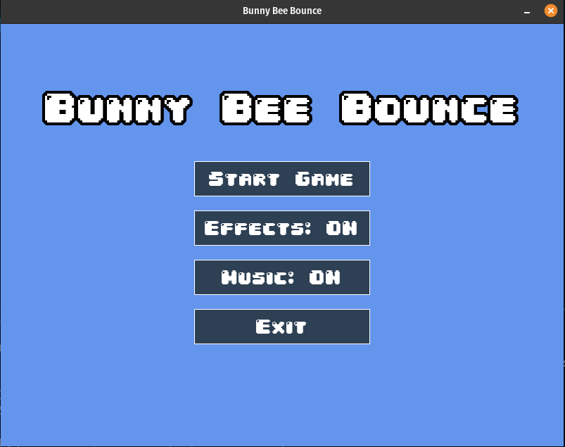
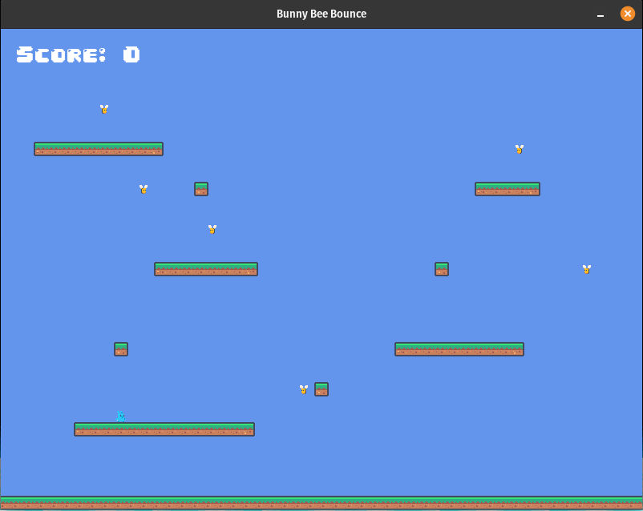
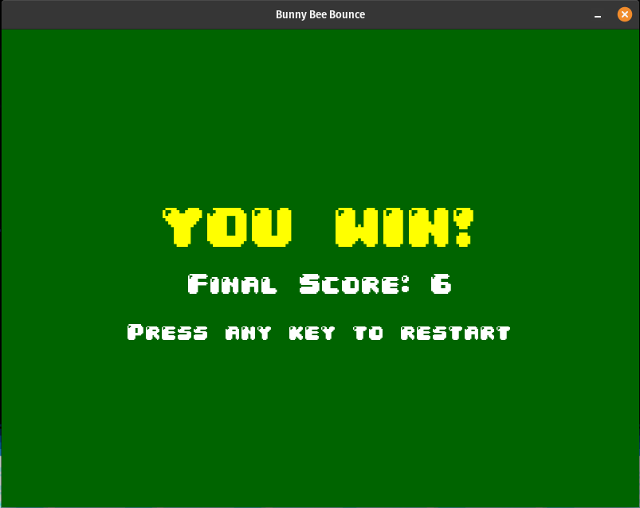
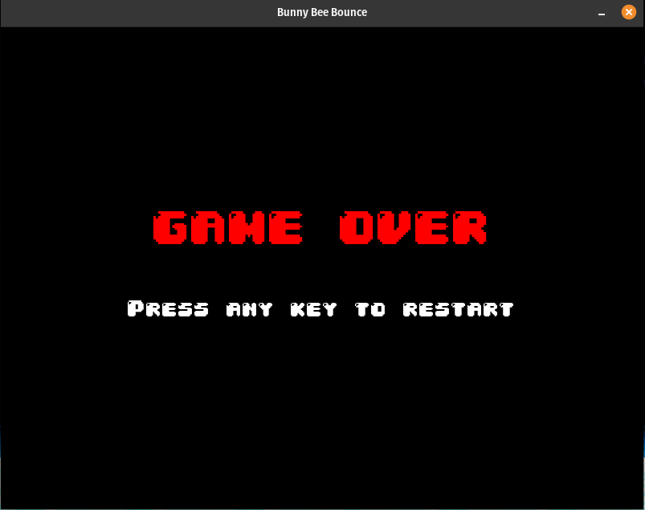

# 🐰 Bunny Bee Bounce 🐝

## 🎮 Sobre o Jogo

**Bunny Bee Bounce** é um jogo de plataforma 2D desenvolvido em **Python** com a biblioteca **Pygame Zero**.
Você controla um coelhinho corajoso em uma jornada vertical enfrentando abelhas malvadas! 
Derrote todas as abelhas pulando sobre elas e conquiste a vitória!  

## Screenshots

Aqui estão algumas telas que mostram o visual e o funcionamento do jogo.

### Menu Principal

A tela inicial, onde o jogador pode iniciar uma nova partida, ligar/desligar os efeitos sonoros e a música de fundo, ou fechar o jogo.



### Gameplay

A tela principal da partida. O objetivo é controlar o coelho, pular nas plataformas e derrotar todas as abelhas pulando em cima delas para ganhar pontos.



### Tela de Vitória

Esta tela aparece quando o jogador consegue derrotar todas as abelhas. Ela exibe a pontuação final e permite que o jogador reinicie a partida.



### Tela de Game Over

Se o jogador cair tocar em uma abelha pelas laterais, a partida termina. A tela de Game Over é exibida, dando a opção de reiniciar o jogo.



---

## 🕹️ Controles

| Tecla           | Ação                     |
|----------------|--------------------------|
| ⬅️ Seta Esquerda | Mover para a esquerda    |
| ➡️ Seta Direita  | Mover para a direita     |
| ⬆️ Barra de Espaço | Pular                    |
| 🖱️ Mouse          | Clicar nos botões do menu |

---

## 🚀 Como Rodar o Projeto

> **Pré-requisitos:** Python 3+ instalado em sua máquina.

1. **Clone o repositório:**

```bash
git clone https://github.com/MariaJuliaBat/Platformer-Game.git

```

2. **Crie e ative um ambiente virtual (recomendado):**

```bash
# Criar ambiente
python -m venv .venv

# Ativar no Linux/Mac
source .venv/bin/activate

# Ativar no Windows
.venv\Scripts\activate
```

3. **Instale as dependências:**

```bash
pip install pgzero
```

4. **Execute o jogo:**

```bash
pgzrun main.py
```

---

## 🛠️ Tecnologias Utilizadas

- 🐍 [Python](https://www.python.org/)
- 🎮 [Pygame Zero](https://pygame-zero.readthedocs.io/)

---

